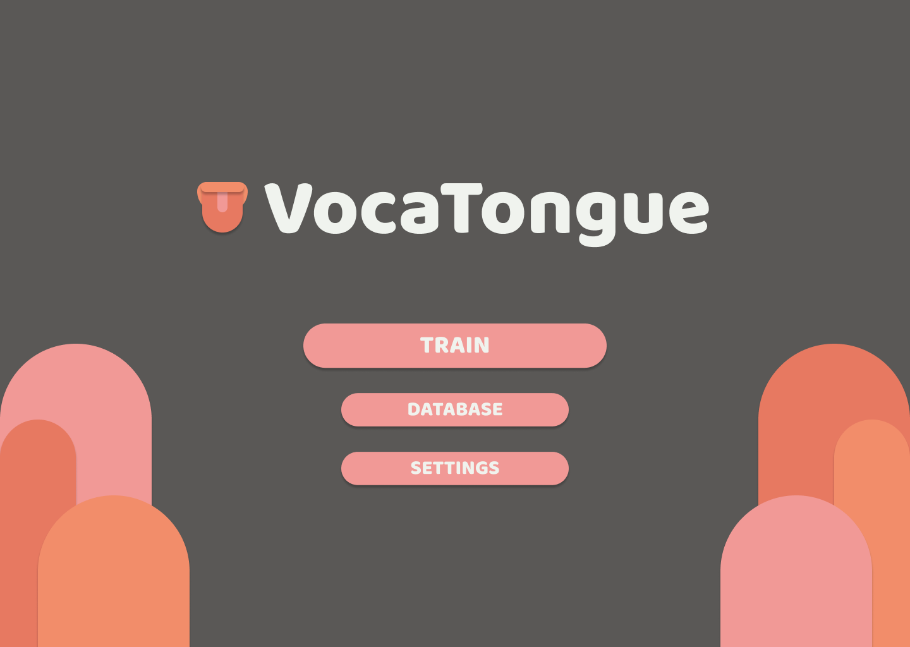
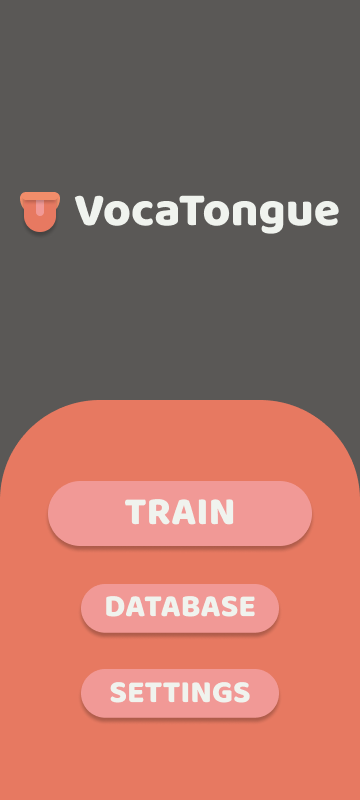

# VocaTongue
VocaTongue is a lightweight, cross-platform language flashcard app.

The application supports multiple platforms, including Android and Windows (more to come).
## Features
- vocabulary training
- wordlists management

There's a possibility of adding training statistics in future updates.
## Preview

    

        Click to reveal images
    

